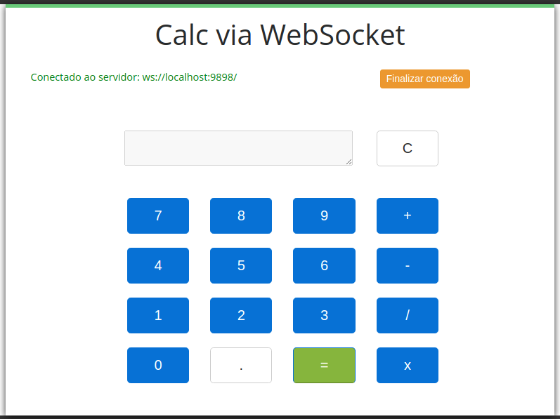

## 04 - Arquitetura de Software na Plataforma Node.js



### Atividade Prática 2 - Unidade 4

#### Aplicações Web em Node.js Conexão HTTP e Websocket

O objetivo deste exercício é garantir que o aluno seja capaz de construir aplicações web em Node.js, utilizando tanto o protocolo HTTP quanto o protocolo de conexão persistente 1. Websocket.

Utilizando os conteúdos apresentados em todas as unidades desta disciplina (especialmente aqueles contidos nas unidades 3 e 4), você deverá construir uma aplicação Web capaz de retornar uma aplicação web (conteúdos estáticos HTML, CSS e JS) e também de manter conexões persistentes vindas de clientes na web.

 1. Crie um projeto em Node.js;
 2. Crie uma página web (HTML, CSS e Javascript) capaz de se conectar e enviar mensagens simples de textos para servidores que suportem conexão Websocket;
 3. Defina um arquivo principal para a sua aplicação (index.js);
 4. Utilizando o framework Express.js, construa uma aplicação capaz de receber requisições HTTP de método GET e retornar o conteúdo estático criado no passo 2;
 5. Utilizando o framework ws, faça com que a aplicação web criada no passo anterior também seja capaz de receber conexões websocket.
 6. Sua conexão Websocket deverá ser capaz de receber mensagens de texto contendo operações matemáticas simples (adição, subtração, multiplicação e divisão) e retornar o resultado das mesmas para o cliente;
 7. Envie as mensagens abaixo através da aplicação web criada no passo 2

    a) 1 + 1

    b) -123 + 123123

    c) 8 * 0

    d) 1239123 * 12313

    e) 123 / -12

    f) 313123 / 0

 > Faça os tratamentos necessários em seu código para evitar problemas em tempo de execução

 > Compartilhe seu projeto no fórum da disciplina

#### Executar localmente

```sh
# run this command on /ws-server dir
npm run upserver
```